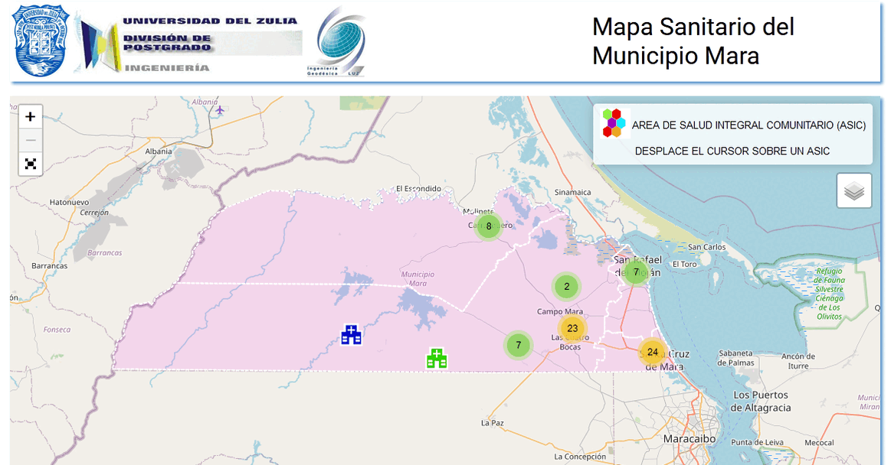

# TEG-MAPA-SALUD
Sistema de información geográfico para la administración de la red de Atención Primaria de Salud del Municipio Mara, Estado Zulia.
Trabajo de Grado - Universidad del Zulia.

## Overview



## Demo
<a targert="_bank" href="https://juanfernandez2306.github.io/TEG-MAPA-SALUD/">Demo</a>

## Framework
- Leaflet JS

## Instalación
Clonar proyecto
```
	git clone https://github.com/juanfernandez2306/TEG-MAPA-SALUD.git
```
